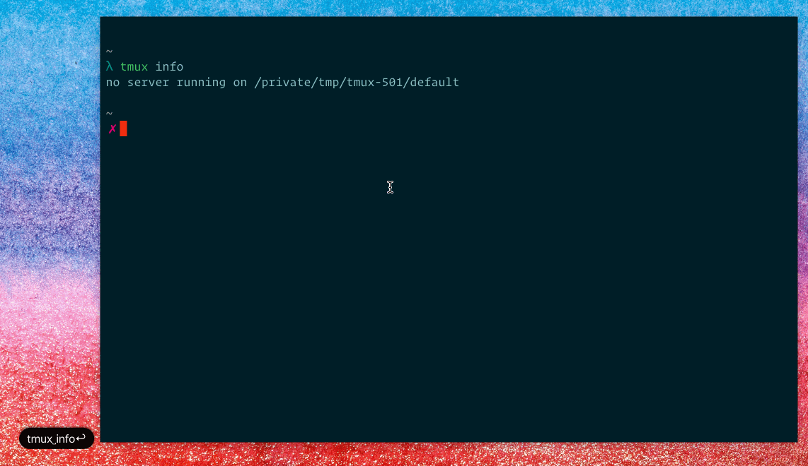

# tmux-tui

[](https://travis-ci.org/stoeffel/tmux-tui)
[](https://hackage.haskell.org/package/tmux-tui)
[](LICENSE)

## A TUI to manage tmux.

This is a TUI to manage tmux sessions.

**It's currently under heavy construction :construction:.**



## Usage

### Installation

```sh
$ git clone git@github.com:stoeffel/tmux-tui.git
$ cabal install
```

I recommend setting up a keybinding to get to the TUI from anywhere.

`bind -n C-h new-window -n tmux-tui -c "#{pane_current_path}" "tmux-tui"`


### Starting

`tmux-tui` will startup `tmux` if you are running the command from outside `tmux`.
It creates a session that will be destroyed after you start or create a session.


### The TUI

There are 4 panels.

**Stored**: Contains stored session.
  Stores:
  * layout
  * windows and panes
  * current path and command (might not work yet in non OSX OS) of panes.
**Sessions**: Active sessions
**Windows**: Windows in session or stored session.
**Panes**: Panes dependant on focus per window or session.

There is a context sensitive help at the bottom of the screen.

### General: Keybindings

| Keybinding                      | Behaviour                                                            |
| :--------:                      | ---------                                                            |
| j,k,:arrow_up:, :arrow_down:    | Moving up and down in the list.                                      |
| h,l,:arrow_left:, :arrow_right: | Moving between panels.                                               |
| q                               | Immidiatelly exits tmux-tui.                                         |
| esc                             | Either clears filter in panel, stops pasting mode or exits tmux-tui. |
| /                               | Search in panel.                                                     |
| d                               | Delete Stored/Session/Window/Pane.                                   |
| y                               | Yank Window/Pane.                                                    |
| p                               | Paste Window/Pane to Session/Window/Below Pane.                      |

### Stored: Keybindings

| Keybinding | Behaviour                                                                                                                |
| :--------: | ---------                                                                                                                |
| space      | Instantiate a session of this type. <br/> This will ask for a session name if there is already a session with this name. |

### Sessions: Keybinding

| Keybinding | Behaviour             |
| :--------: | ---------             |
| space      | Attach to session.    |
| s          | Store session.        |
| c          | Create a new session. |
| r          | Rename session.       |

### Windows: Keybindings

| Keybinding | Behaviour                        |
| :--------: | ---------                        |
| space      | Switch to window.                |
| c          | Create a new window.             |
| r          | Rename window.                   |
| J,K        | Move window up and down.         |
| m          | Merge window with the one below. |
